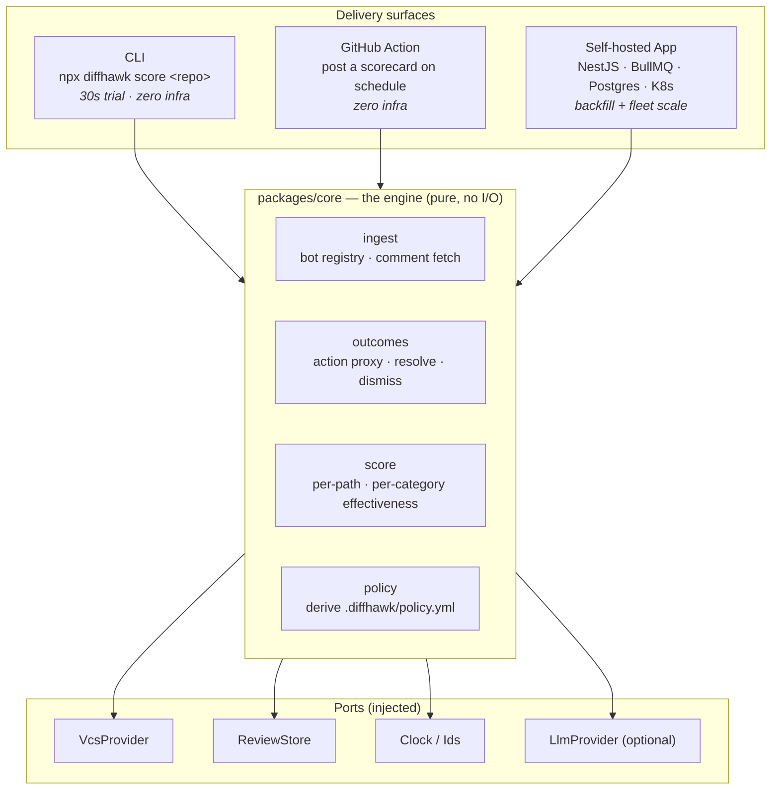
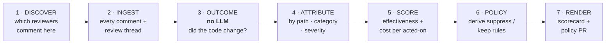
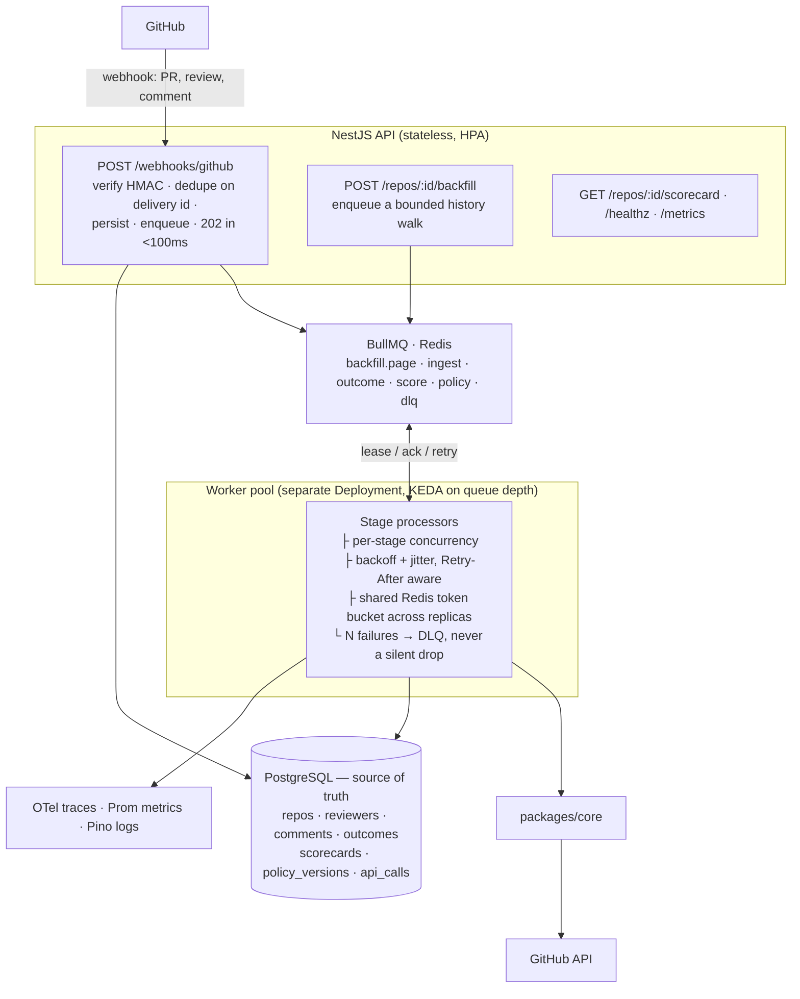

# DiffHawk — Architecture

## The structural idea: one measurement engine, many surfaces

> **The engine that turns a repository's review history into an effectiveness
> scorecard is a pure library — no framework, no network, no database. Every
> other component is a delivery surface or a data source wrapped around it.**

The [AI Code Review Census](https://github.com/AnishBplayz/ai-reviewer-census)
already proved the core of this engine works at scale: bot identification,
comment ingestion, and the git-based action proxy ran cleanly across 716 repos
and 15,000+ PRs. DiffHawk **promotes that scanner from a study script into a
product engine** rather than starting from scratch.



Why three surfaces:

- **The CLI is the funnel.** `npx diffhawk score owner/repo` with a token and
  nothing else prints your reviewer's scorecard in 30 seconds. A tool you can try
  without provisioning Postgres gets tried.
- **The Action is the habit.** A weekly scorecard comment on your repo, or a
  policy PR, using the caller's own `GITHUB_TOKEN`.
- **The self-hosted App is the depth.** Backfilling years of PR history is a real
  distributed job — this is where the queue, retries, dead-letter, idempotency,
  and independent scaling live, and where the job-search systems story is earned.

All three run identical scoring logic. The engine is testable with zero I/O,
which is the only reason the scoring can be regression-tested at all.

---

## The measurement pipeline

Not one query. A staged pipeline, each stage independently retryable and — in App
mode — a separate queue job.



### 1 · DISCOVER

Deterministic. Identify which AI reviewers are active on a repo by matching
comment/review authors against the bot registry (`packages/ingest` — the census
registry, already covering 20+ vendors and self-tested against known-positive
repos). Report which reviewers were found and never guess an unknown `[bot]` into
the AI bucket.

### 2 · INGEST

For each pull request, every inline review thread and top-level review, stored as
raw records: author, path, anchored line, body, timestamps, thread state. This is
the census scanner's GraphQL path, hardened.

> **GitHub reports bot logins inconsistently** — REST returns `example[bot]`,
> GraphQL returns `example`. This bit the census hard (it silently reported 0%
> coverage) and is a first-class, tested concern in the ingest layer.

### 3 · OUTCOME — the stage that needs no model

Pure git/GraphQL. For each comment thread, resolve its outcome:

- **acted-on** — GitHub marks the thread `isOutdated`, i.e. the anchored code
  changed after the comment. The census's validated action proxy.
- **resolved** — a human explicitly resolved the thread.
- **dismissed** — a review was dismissed, or the comment was replied-to-and-closed
  without a change.
- **ignored** — none of the above by the time the PR merged/closed.

Cheap, deterministic, replayable offline. No tokens. This is the honest core of
the whole product, and its limitations are documented, not hidden (see below).

### 4 · ATTRIBUTE

Bucket every outcome by:
- **path glob** — `src/services/**`, `**/*.generated.*`, `migrations/**`, …
- **comment category** — inferred cheaply from the reviewer's own labelling where
  present, or a small classifier where not (the one optional LLM touchpoint, and
  it never gates the core signal).
- **severity** — as declared by the reviewer.

### 5 · SCORE

```
effectiveness(bucket) = acted_on / total
noise(bucket)         = 1 - effectiveness
cost_per_acted_on     = bucket_cost / acted_on     (where cost is known)
```

Ranked so the biggest noise sources surface first. Trends tracked over time so a
reviewer that degrades after a model change is visible.

### 6 · POLICY

Turn the scorecard into `.diffhawk/policy.yml`: paths to suppress (high volume,
near-zero action), paths to keep, and a confidence note per rule. Conservative by
default — it proposes, a human merges. **DiffHawk never silently changes what your
reviewer does.**

### 7 · RENDER

A scorecard (comment or dashboard) and, optionally, a pull request that adds the
suppression rules to the reviewer's own config or to a `.diffhawk/policy.yml` a
lightweight Action enforces. Deterministic code does the writing; no model output
becomes an action (see Threat Model).

---

## Core schemas

The contract between stages, Zod-validated at every boundary.

```ts
export const ReviewComment = z.object({
  id:        z.string(),           // stable hash(repo, pr, author, path, line, createdAt)
  repo:      z.string(),
  pr:        z.number(),
  reviewer:  z.string(),           // canonical vendor, resolved at analysis time
  path:      z.string(),
  line:      z.number().int().nullable(),
  category:  z.string().nullable(),
  severity:  z.enum(['critical','high','medium','low','unknown']),
  bodyLength:z.number(),
  createdAt: z.string(),
});

export const Outcome = z.object({
  comment_id: z.string(),
  kind: z.enum(['acted_on','resolved','dismissed','ignored']),
  // Why we believe it. Makes every number auditable back to a git fact.
  evidence: z.enum(['thread_outdated','thread_resolved','review_dismissed','pr_closed_unchanged']),
});

export const Scorecard = z.object({
  repo: z.string(),
  reviewer: z.string(),
  window: z.object({ from: z.string(), to: z.string() }),
  totals: z.object({ comments: z.number(), actedOn: z.number(), effectiveness: z.number() }),
  byPath: z.array(z.object({
    glob: z.string(), comments: z.number(), actedOn: z.number(),
    effectiveness: z.number(), recommendation: z.enum(['keep','suppress','watch']),
  })),
  byCategory: z.array(z.object({ category: z.string(), comments: z.number(), effectiveness: z.number() })),
  cost: z.object({ usd: z.number().nullable(), perActedOn: z.number().nullable() }),
  // First-class, never a logging afterthought — the honesty surface.
  caveats: z.array(z.string()),
});
```

`caveats` is part of the type: the action proxy's known biases travel *with* every
scorecard rather than living in a doc nobody reads.

---

## Self-hosted App mode — the systems layer

The reason the queue exists is **historical backfill**. Scoring a repo means
walking years of its PR and comment history — thousands of API calls, under strict
rate limits, resumable, exactly-once. This is a genuine distributed job, not a
webhook that fires one LLM call.



### Non-negotiable properties

**Postgres is truth; Redis is transport.** A total Redis loss re-enqueues from
non-terminal Postgres rows. The measurement record — every comment and its
outcome — is durable and queryable; that's what the scorecards, trends, and
regression tests read from.

**Backfill is resumable and paginated.** A history walk checkpoints per page
(the census's append-only + cursor pattern, promoted to Postgres). Killing a
worker mid-backfill resumes at the next page, once, with no double-counted
comments.

**Idempotency everywhere.** Webhook dedupe on `X-GitHub-Delivery`; comment
uniqueness on `hash(repo, pr, author, path, line, createdAt)`; scorecard
uniqueness on `(repo, reviewer, window)`. Replays and re-opened PRs never
double-count — which, for a *measurement* product, is not a nicety but a
correctness requirement: a double-counted comment is a lie in the scorecard.

**Rate-limit-aware backoff.** GitHub's secondary limits answer 403 + Retry-After,
not 429; the census hit this and handles it. A Redis-shared token bucket sits in
front of the API client so scaling workers up doesn't scale into a ban — the
honest answer to "how does the backfill not get you rate-limited."

**Dead-letter is inspectable and replayable.** DLQ jobs keep full stage input;
`GET /repos/:id/scorecard` reports honest partial state; a retry endpoint replays.

**Graceful shutdown.** SIGTERM drains in-flight, releases leases; rolling deploys
don't orphan a backfill.

### Data model

```
repos ─┬─ reviewers ─┬─ comments ──┬─ outcomes        (one row, one git-verifiable fact)
       │             │             └─ categories
       │             └─ scorecards ── scorecard_paths  (per-glob effectiveness snapshot)
       ├─ policy_versions   (every generated policy, diffable over time)
       └─ api_calls         (GitHub call ledger: endpoint, cost-in-points, latency, retries)
```

`api_calls` turns "backfill is expensive" into an exact number and drives the
shared rate limiter. `policy_versions` makes "what did we suppress, and did
effectiveness recover after?" a query, not a guess.

---

## Threat model

DiffHawk reads pull requests — **attacker-controlled input on every invocation.**

| Threat | Defense |
|---|---|
| **Prompt injection** in a diff or comment (only relevant to the optional classifier / own-reviewer) | Untrusted content is delimited and labelled; model output is structured-only and never becomes an action; policy and posting are deterministic code. Injection canaries in CI. |
| **A reviewer's comment body crafted to skew the scorecard** | The core outcome signal is git state (`isOutdated`), not comment text — it cannot be gamed by wording. Text is used only for optional categorisation, which never gates a number. |
| **Fork PRs / secret exfiltration** | Action defaults to `pull_request` (no secrets on forks); `pull_request_target` is opt-in with a loud warning. |
| **Token scope** | `pull_requests: read`, `contents: read`, `metadata: read`. Write scope only for the optional policy-PR surface, and only `pull_requests: write`. Never merges, never writes code. |
| **Cost / rate-limit DoS via a huge repo** | Per-repo backfill page cap, per-install daily point budget, diff-size ceilings. |

Writing this section is not box-ticking. "Here is how I reasoned about my own
attack surface, and here is the test suite that enforces it" is one of the
strongest signals a portfolio project carries.

---

## Technology choices

| Layer | Choice | Why |
|---|---|---|
| Language | TypeScript strict, Node 22 LTS | One language across engine, API, worker, CLI, Action — and the census is already this. |
| Monorepo | pnpm workspaces (Turborepo at scale) | Smallest tool that works; add build caching when CI is actually slow. |
| API | NestJS 11 + Fastify | Named job-gap tech; DI makes the ports/adapters split natural. |
| Queue | BullMQ v5 + Redis 7 | Named job-gap tech; real backoff + DLQ primitives; the backfill needs them for real. |
| DB | PostgreSQL 16 + Drizzle | SQL stays visible; migrations are plain files. |
| Validation | Zod | One schema source for webhooks, config, and structured output. |
| VCS | Octokit + `@octokit/webhooks` | Signature verification not hand-rolled. |
| Parsing | web-tree-sitter (wasm) | Path/symbol attribution without native build pain (and reused by the optional reviewer). |
| LLM (optional) | Anthropic SDK behind `LlmProvider` | Only the categoriser and the optional own-reviewer touch it; interface exists day one so Ollama/OpenAI adapters are ideal first contributions. |
| Tests | Vitest + Testcontainers | Real Postgres/Redis in integration tests; a chaos test that kills a worker mid-backfill. |
| Obs | Pino + OpenTelemetry + Prometheus | Traces span webhook → queue → stage → API call. |
| Container | Distroless, non-root, multi-stage | Small, and what a Dockerfile reviewer wants to see. |
| Orchestration | K8s + Kustomize overlays, KEDA on queue depth | Named job-gap tech; KEDA is the honest answer to "how does the worker scale." |
| CI | lint · typecheck · unit · integration · injection canaries · **scoring-regression gate** | The regression gate is the unusual, senior one. |

### `.diffhawk/policy.yml`

```yaml
version: 1
reviewers: [coderabbitai]        # which reviewer this policy governs
suppress:                         # derived from the scorecard, human-merged
  - path: "**/*.generated.ts"     # 47 comments / 90d, 2% acted on
  - path: "migrations/**"         # 23 comments / 90d, 0% acted on
  - path: "pnpm-lock.yaml"
keep:
  - path: "src/services/**"       # 54% acted on — do not touch
report:
  cadence: weekly
  post_scorecard: true
```

---

## Repository layout

```
diffhawk/
├── apps/
│   ├── api/                  NestJS — webhooks, backfill trigger, scorecard, health
│   ├── worker/               BullMQ stage processors (backfill, ingest, outcome, score)
│   ├── cli/                  npx diffhawk score — the funnel
│   └── web/                  Dashboard (later): scorecards, trends, policy diffs
├── packages/
│   ├── core/                 THE ENGINE. Pure. ingest · outcomes · score · policy
│   ├── ingest/               bot registry + comment fetch (promoted from the census)
│   ├── github/               VcsProvider adapter + webhook verification
│   ├── db/                   Drizzle schema, migrations, ReviewStore
│   ├── policy/               .diffhawk/policy.yml parse, derive, enforce
│   ├── config/               config parse + defaults + merge
│   ├── llm-anthropic/        optional LlmProvider (categoriser + own-reviewer)
│   └── eval/                 scoring-regression harness (shared lineage with the census)
├── action/                   GitHub Action wrapper (bundled)
├── deploy/{docker,k8s}/      compose + base/ + overlays + KEDA/HPA/PDB
└── docs/                     POSITIONING · ARCHITECTURE · ROADMAP · DECISIONS
```

The dependency rule, lint-enforced: **`packages/core` may not import from
`apps/*` or from any adapter.** If core ever imports Octokit, the boundary failed.
